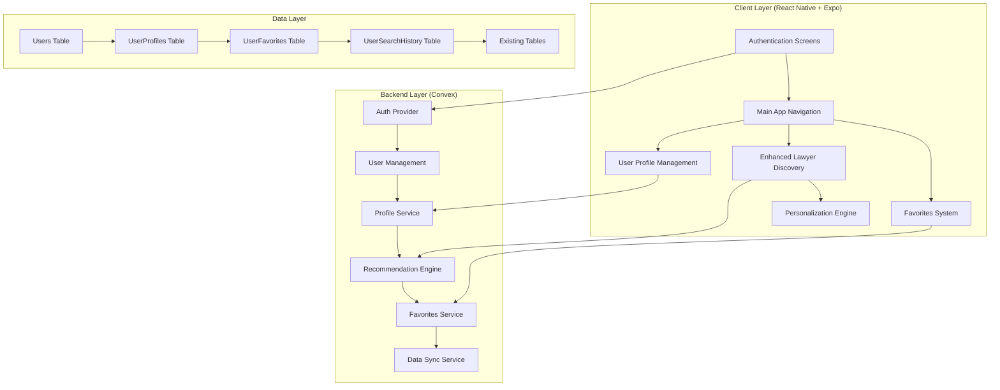
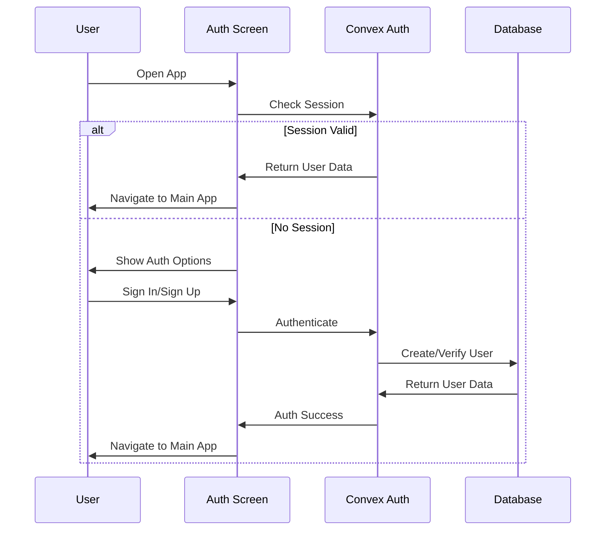
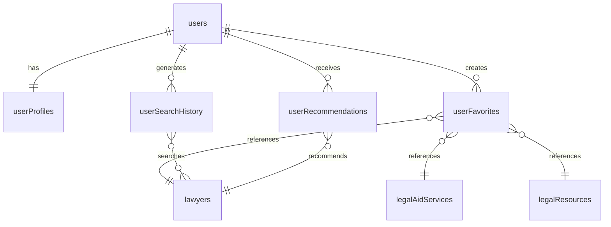

# Design Document

## Overview

This design document outlines the implementation of user authentication and enhanced lawyer discovery features for the Access Alberta Legal mobile application. The design builds upon the existing React Native + Expo + Convex architecture while introducing sophisticated user management, personalization capabilities, and professional UI polish.

The solution leverages Convex's built-in authentication system for secure user management, implements intelligent recommendation algorithms for lawyer discovery, and introduces Rive animations for professional user experience. The design maintains the existing clean architecture while extending it with new data models and user-centric features.

## Architecture

### High-Level Architecture



### Authentication Flow



## Components and Interfaces

### Authentication Components

#### AuthNavigator
- **Purpose**: Manages authentication flow and session state
- **Props**: None (uses Convex auth context)
- **State**: Authentication status, loading states
- **Methods**: 
  - `checkAuthStatus()`: Verifies current session
  - `handleAuthSuccess()`: Navigates to main app after authentication

#### SignInScreen
- **Purpose**: User login interface with validation
- **Props**: Navigation props
- **State**: Email, password, validation errors, loading state
- **Methods**:
  - `validateForm()`: Client-side validation
  - `handleSignIn()`: Processes login attempt
  - `handleForgotPassword()`: Initiates password reset

#### SignUpScreen
- **Purpose**: User registration with profile setup
- **Props**: Navigation props
- **State**: User form data, validation state, step tracking
- **Methods**:
  - `validateStep()`: Validates current form step
  - `handleNext()`: Progresses through registration steps
  - `handleSignUp()`: Creates new user account

#### ProfileScreen
- **Purpose**: User profile management and preferences
- **Props**: User data from Convex
- **State**: Profile form data, edit mode, save status
- **Methods**:
  - `handleProfileUpdate()`: Saves profile changes
  - `handleLocationUpdate()`: Updates location preferences
  - `handleInterestsUpdate()`: Manages legal interest preferences

### Enhanced Discovery Components

#### PersonalizedLawyerSearch
- **Purpose**: Intelligent lawyer search with personalization
- **Props**: User preferences, search history
- **State**: Search query, filters, results, recommendations
- **Methods**:
  - `performSearch()`: Executes search with personalization
  - `applyFilters()`: Applies and saves filter preferences
  - `getRecommendations()`: Fetches personalized recommendations
  - `trackSearchBehavior()`: Records user search patterns

#### LawyerRecommendationEngine
- **Purpose**: Generates personalized lawyer recommendations
- **Props**: User profile, search history, preferences
- **State**: Recommendation scores, algorithm parameters
- **Methods**:
  - `calculateRelevanceScore()`: Scores lawyers based on user profile
  - `applyLocationPreference()`: Prioritizes local lawyers
  - `considerSearchHistory()`: Uses past searches for recommendations
  - `generateExplanations()`: Creates recommendation explanations

#### FavoritesManager
- **Purpose**: Manages user favorites across all content types
- **Props**: User ID, content type filters
- **State**: Favorites list, sync status, categories
- **Methods**:
  - `addToFavorites()`: Adds item to user favorites
  - `removeFromFavorites()`: Removes item with confirmation
  - `syncFavorites()`: Synchronizes favorites across devices
  - `organizeFavorites()`: Categorizes and sorts favorites

### Animation Components

#### RiveAnimationWrapper
- **Purpose**: Wrapper for Rive animations with loading states
- **Props**: Animation file, trigger conditions, loop settings
- **State**: Animation state, loading status
- **Methods**:
  - `playAnimation()`: Triggers animation playback
  - `pauseAnimation()`: Pauses current animation
  - `resetAnimation()`: Resets animation to initial state

#### TransitionAnimator
- **Purpose**: Manages screen transitions and micro-interactions
- **Props**: Transition type, duration, easing
- **State**: Animation progress, completion status
- **Methods**:
  - `animateTransition()`: Executes screen transitions
  - `animateMicroInteraction()`: Handles button/card animations
  - `animateListItems()`: Staggered list item animations

## Data Models

### Extended Database Schema

```typescript
// New tables to add to existing schema
export const extendedSchema = {
  users: defineTable({
    email: v.string(),
    name: v.string(),
    profileImageUrl: v.optional(v.string()),
    createdAt: v.number(),
    lastLoginAt: v.number(),
  }),
  
  userProfiles: defineTable({
    userId: v.id("users"),
    location: v.optional(v.object({
      city: v.string(),
      province: v.string(),
      postalCode: v.optional(v.string()),
    })),
    legalInterests: v.array(v.string()),
    preferredLanguages: v.array(v.string()),
    notificationPreferences: v.object({
      email: v.boolean(),
      push: v.boolean(),
      sms: v.boolean(),
    }),
    searchRadius: v.optional(v.number()), // in kilometers
    updatedAt: v.number(),
  }),
  
  userFavorites: defineTable({
    userId: v.id("users"),
    itemType: v.string(), // "lawyer", "legalAidService", "legalResource"
    itemId: v.string(),
    addedAt: v.number(),
    notes: v.optional(v.string()),
  }),
  
  userSearchHistory: defineTable({
    userId: v.id("users"),
    searchType: v.string(), // "lawyer", "legalAid", "resource"
    searchQuery: v.optional(v.string()),
    filters: v.object({
      specialty: v.optional(v.array(v.string())),
      location: v.optional(v.string()),
      acceptsLegalAid: v.optional(v.boolean()),
      languages: v.optional(v.array(v.string())),
      rating: v.optional(v.number()),
    }),
    resultsCount: v.number(),
    clickedResults: v.array(v.string()),
    searchedAt: v.number(),
  }),
  
  userRecommendations: defineTable({
    userId: v.id("users"),
    itemType: v.string(),
    itemId: v.string(),
    relevanceScore: v.number(),
    reasons: v.array(v.string()),
    generatedAt: v.number(),
    clicked: v.boolean(),
  }),
};
```

### Data Relationships



## Error Handling

### Authentication Error Handling

```typescript
interface AuthError {
  type: 'INVALID_CREDENTIALS' | 'NETWORK_ERROR' | 'VALIDATION_ERROR' | 'ACCOUNT_LOCKED';
  message: string;
  retryable: boolean;
  retryAfter?: number;
}

class AuthErrorHandler {
  handleError(error: AuthError): void {
    switch (error.type) {
      case 'INVALID_CREDENTIALS':
        this.showUserFriendlyMessage('Invalid email or password');
        this.incrementFailedAttempts();
        break;
      case 'NETWORK_ERROR':
        this.showRetryOption(error.retryAfter);
        break;
      case 'VALIDATION_ERROR':
        this.highlightInvalidFields(error.message);
        break;
      case 'ACCOUNT_LOCKED':
        this.showAccountRecoveryOptions();
        break;
    }
  }
}
```

### Data Synchronization Error Handling

```typescript
interface SyncError {
  operation: 'FAVORITES_SYNC' | 'PROFILE_UPDATE' | 'SEARCH_HISTORY';
  conflictType?: 'VERSION_CONFLICT' | 'DATA_CORRUPTION';
  localData: any;
  serverData: any;
}

class SyncErrorHandler {
  handleSyncError(error: SyncError): Promise<void> {
    switch (error.operation) {
      case 'FAVORITES_SYNC':
        return this.resolveFavoritesConflict(error);
      case 'PROFILE_UPDATE':
        return this.resolveProfileConflict(error);
      case 'SEARCH_HISTORY':
        return this.mergeSearchHistory(error);
    }
  }
}
```

### Offline Error Handling

```typescript
class OfflineHandler {
  private queuedOperations: QueuedOperation[] = [];
  
  handleOfflineOperation(operation: QueuedOperation): void {
    this.queuedOperations.push(operation);
    this.showOfflineIndicator();
    this.persistQueuedOperations();
  }
  
  async syncWhenOnline(): Promise<void> {
    if (this.isOnline()) {
      for (const operation of this.queuedOperations) {
        try {
          await this.executeOperation(operation);
          this.removeFromQueue(operation);
        } catch (error) {
          this.handleSyncError(error, operation);
        }
      }
    }
  }
}
```

## Testing Strategy

### Unit Testing Approach

```typescript
// Authentication component testing
describe('SignInScreen', () => {
  it('should validate email format', () => {
    const { getByTestId } = render(<SignInScreen />);
    const emailInput = getByTestId('email-input');
    
    fireEvent.changeText(emailInput, 'invalid-email');
    fireEvent.press(getByTestId('sign-in-button'));
    
    expect(getByTestId('email-error')).toHaveTextContent('Invalid email format');
  });
  
  it('should handle successful authentication', async () => {
    const mockAuth = jest.fn().mockResolvedValue({ success: true });
    const { getByTestId } = render(<SignInScreen authFunction={mockAuth} />);
    
    fireEvent.changeText(getByTestId('email-input'), 'test@example.com');
    fireEvent.changeText(getByTestId('password-input'), 'password123');
    fireEvent.press(getByTestId('sign-in-button'));
    
    await waitFor(() => {
      expect(mockAuth).toHaveBeenCalledWith('test@example.com', 'password123');
    });
  });
});
```

### Integration Testing

```typescript
// Recommendation engine testing
describe('LawyerRecommendationEngine', () => {
  it('should prioritize lawyers based on user preferences', async () => {
    const userProfile = {
      legalInterests: ['Family Law'],
      location: { city: 'Calgary', province: 'Alberta' },
      preferredLanguages: ['English', 'French']
    };
    
    const recommendations = await recommendationEngine.getRecommendations(userProfile);
    
    expect(recommendations[0].reasons).toContain('Matches your interest in Family Law');
    expect(recommendations[0].reasons).toContain('Located in Calgary');
  });
});
```

### End-to-End Testing

```typescript
// User journey testing
describe('Authentication to Lawyer Search Journey', () => {
  it('should complete full user flow', async () => {
    // Sign up new user
    await signUp('newuser@example.com', 'password123', 'John Doe');
    
    // Set up profile preferences
    await setProfilePreferences({
      legalInterests: ['Criminal Law'],
      location: { city: 'Edmonton', province: 'Alberta' }
    });
    
    // Search for lawyers
    const searchResults = await searchLawyers('criminal defense');
    
    // Verify personalized results
    expect(searchResults[0].specialty).toContain('Criminal Law');
    expect(searchResults[0].location).toContain('Edmonton');
    
    // Add to favorites
    await addToFavorites(searchResults[0].id);
    
    // Verify favorites persistence
    const favorites = await getFavorites();
    expect(favorites).toContain(searchResults[0].id);
  });
});
```

### Performance Testing

```typescript
// Animation performance testing
describe('Animation Performance', () => {
  it('should maintain 60fps during transitions', async () => {
    const performanceMonitor = new PerformanceMonitor();
    performanceMonitor.start();
    
    await navigateWithAnimation('/lawyers');
    
    const metrics = performanceMonitor.getMetrics();
    expect(metrics.averageFPS).toBeGreaterThan(58);
    expect(metrics.droppedFrames).toBeLessThan(5);
  });
});
```

## Security Considerations

### Authentication Security

1. **Password Security**
   - Minimum 8 characters with complexity requirements
   - Secure password hashing using Convex built-in security
   - Account lockout after 5 failed attempts
   - Password reset tokens expire after 1 hour

2. **Session Management**
   - JWT tokens with appropriate expiration
   - Automatic session refresh
   - Secure token storage using Expo SecureStore
   - Session invalidation on logout

3. **Data Protection**
   - All API communications over HTTPS
   - Sensitive data encryption at rest
   - User data anonymization for analytics
   - GDPR compliance for data deletion

### Privacy Protection

```typescript
class PrivacyManager {
  anonymizeSearchHistory(userId: string): void {
    // Remove personally identifiable information from search history
    // while preserving recommendation algorithm effectiveness
  }
  
  handleDataDeletion(userId: string): Promise<void> {
    // Complete user data removal as per privacy regulations
    return this.deleteAllUserData(userId);
  }
  
  encryptSensitiveData(data: any): string {
    // Encrypt sensitive user information before storage
    return this.encrypt(data);
  }
}
```

## Performance Optimization

### Recommendation Algorithm Optimization

```typescript
class OptimizedRecommendationEngine {
  private cache = new Map<string, CachedRecommendations>();
  
  async getRecommendations(userId: string): Promise<Recommendation[]> {
    // Check cache first
    const cached = this.cache.get(userId);
    if (cached && !this.isCacheExpired(cached)) {
      return cached.recommendations;
    }
    
    // Generate new recommendations
    const recommendations = await this.generateRecommendations(userId);
    
    // Cache results
    this.cache.set(userId, {
      recommendations,
      generatedAt: Date.now(),
      expiresAt: Date.now() + (30 * 60 * 1000) // 30 minutes
    });
    
    return recommendations;
  }
}
```

### Animation Performance

```typescript
class AnimationOptimizer {
  optimizeListAnimations(items: any[]): void {
    // Use native driver for better performance
    const animations = items.map((_, index) => 
      Animated.timing(this.animatedValues[index], {
        toValue: 1,
        duration: 200 + (index * 50),
        useNativeDriver: true,
        easing: Easing.out(Easing.quad)
      })
    );
    
    Animated.stagger(50, animations).start();
  }
}
```

This design provides a comprehensive foundation for implementing professional-grade authentication and enhanced discovery features while maintaining the existing application's strengths and architecture.